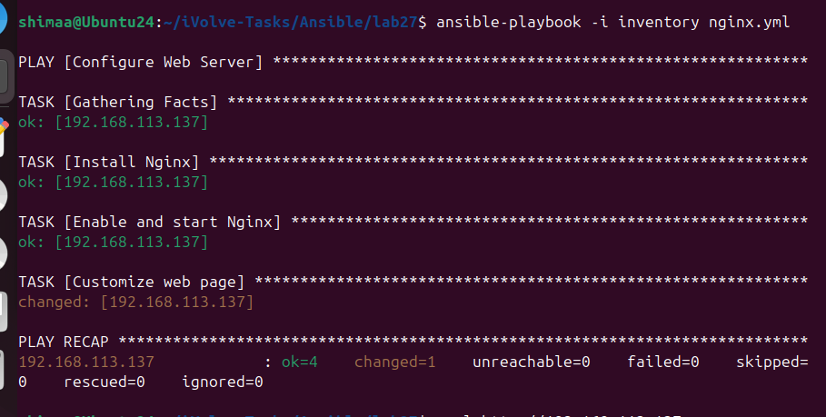
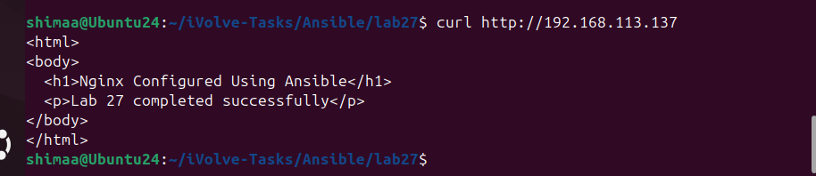

# Lab 27: Automated Web Server Configuration Using Ansible Playbooks

## Objective

Automate the installation and configuration of an Nginx web server using an Ansible playbook.

---

## Step 1:Create Nginx Playbook

```bash
nano nginx.yml

```

```yaml
---
- name: Configure Web Server
  hosts: managed
  become: yes

  tasks:
    - name: Install Nginx
      apt:
        name: nginx
        state: present

    - name: Enable and start Nginx
      service:
        name: nginx
        state: started
        enabled: yes

    - name: Customize web page
      copy:
        dest: /var/www/html/index.html
        content: |
          <html>
          <body>
            <h1>Nginx Configured Using Ansible</h1>
            <p>Lab 27 completed successfully</p>
          </body>
          </html>
```

---

## Step 2:Run the Playbook

```bash
ansible-playbook -i inventory nginx.yml
```



---

## Step 3:Verify Configuration on Managed Node

```bash
curl http://192.168.113.137
```



