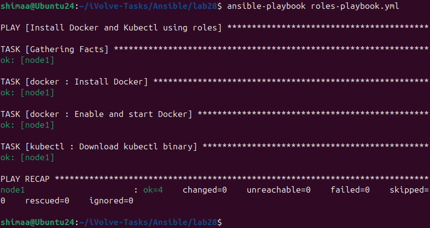

# Lab 28: Structured Configuration Management with Ansible Roles

## Objective

Automate the installation of Docker and kubectl on a managed node using Ansible roles.

---

## Step 1:Create Roles

Docker Role

```bash
mkdir -p roles/docker/tasks
nano roles/docker/tasks/main.yml
```

```yaml
---
- name: Install Docker
  apt:
    name: docker.io
    state: present

- name: Enable and start Docker
  service:
    name: docker
    state: started
    enabled: yes
```

kubectl Role

```bash
mkdir -p roles/kubectl/tasks
nano roles/kubectl/tasks/main.yml
```

```yaml
---
- name: Download kubectl binary
  get_url:
    url: https://dl.k8s.io/release/v1.35.0/bin/linux/amd64/kubectl
    dest: /usr/local/bin/kubectl
    mode: '0755'
```

---

## Step 2:Create Playbook to Use Roles

```bash
nano roles-playbook.yml
```

```yaml
---
- name: Install Docker and Kubectl using roles
  hosts: managed
  become: yes

  roles:
    - docker
    - kubectl
```

---

## Step 3:Run the Playbook

```bash
ansible-playbook -i inventory roles-playbook.yml
```



