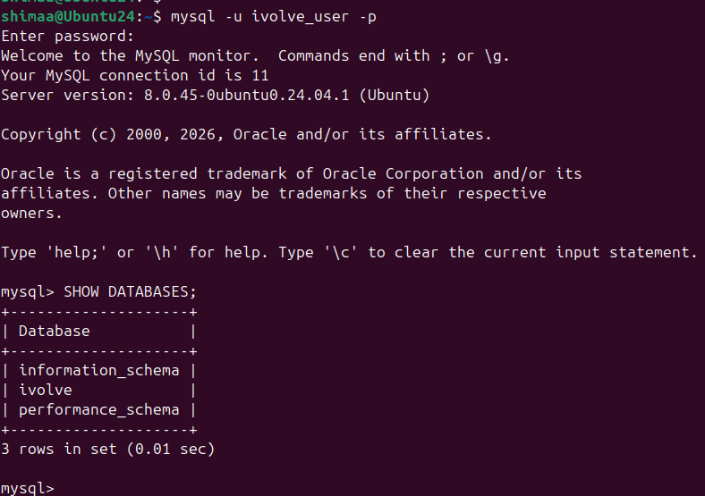

# Lab 28:Securing Sensitive Data with Ansible Vault

## Objective

Automate MySQL database configuration using Ansible while securing sensitive information (database user password) with Ansible Vault.

---

## Step 1:Install Ansible Vault Secret

```bash
ansible-vault create vault.yml
```

## Step 2:Create MySQL Playbook

```bash
nano roles-playbook.yml
```

```yaml
---
- name: Configure MySQL Database
  hosts: managed
  become: yes
  vars_files:
    - vault.yml

  tasks:
    - name: Install MySQL Server
      apt:
        name: mysql-server
        state: present
        update_cache: yes

    - name: Ensure MySQL service is running
      service:
        name: mysql
        state: started
        enabled: yes

    - name: Create iVolve database
      mysql_db:
        name: ivolve
        state: present
        login_unix_socket: /run/mysqld/mysqld.sock

    - name: Create database user
      mysql_user:
        name: ivolve_user
        password: "{{ db_password }}"
        priv: "ivolve.*:ALL"
        host: localhost
        state: present
        login_unix_socket: /run/mysqld/mysqld.sock
```

---

## Step 3:Run the Playbook

```bash
ansible-playbook -i inventory mysql.yml --ask-vault-pass
```

## Step 4:Run the Playbook

```bash
mysql -u ivolve_user -p
```



