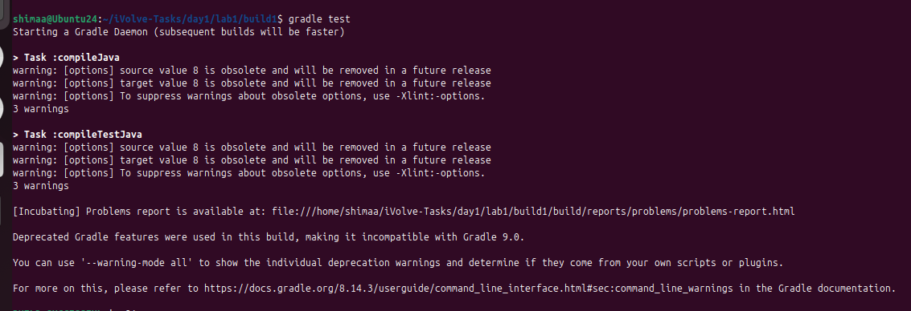
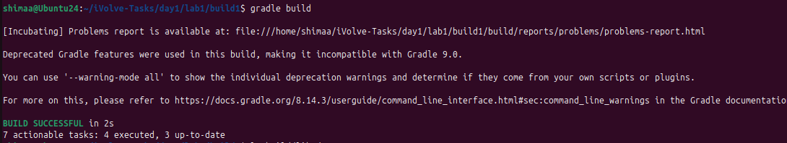
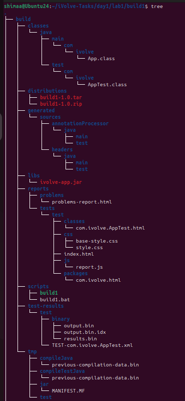

<p align="center">

</p>

## Build Tools with Gradle

This lab demonstrates how to build, test, and package a Java application using Gradle. The steps include installing Gradle, cloning the source code, running unit tests, packaging the application, and running it.

---

## Step 1: Verify Installation

Check that Java and Gradle are properly installed:

```bash
java -version
gradle -v
```

If Gradle is not installed, install it at first 


---

## Step 2: Clone the Repository

Clone the source code from GitHub:

```bash
git clone https://github.com/Ibrahim-Adel15/build1.git
cd build1
```

---

## Step 3: Run Unit Tests

Execute the unit tests for the project:

```bash
gradle test
```



---

## Step 4: Build the Project

Package the project into a JAR file using Gradle:

```bash
gradle build
```

This will generate the artifact in `build/libs/ivolve-app.jar`.



---

## Step 5: Run the Application

Run the packaged Java application using:

```bash
java -jar build/libs/ivolve-app.jar
```


---

```bash
tree
```



---

## Summary

The complete Gradle workflow for this project:
* Install and verify Gradle installation
* Clone the repository from GitHub
* Run unit tests to verify functionality
* Build the JAR artifact with Gradle
* Verify the application is working as expected
