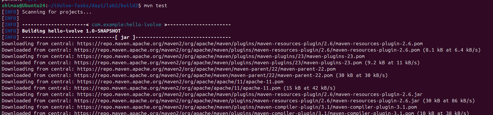
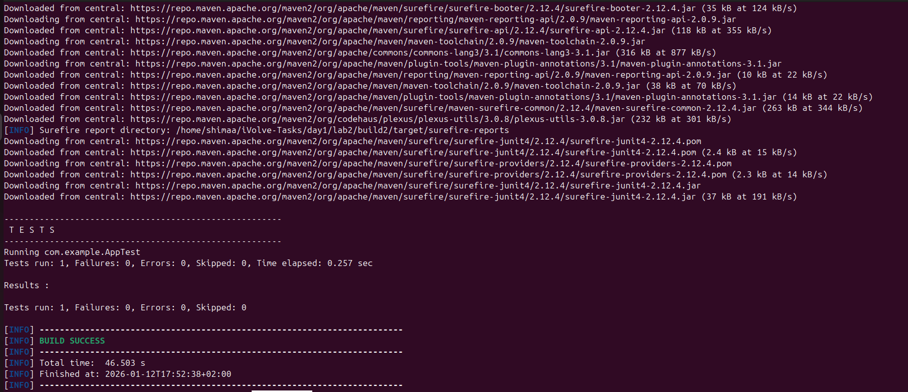
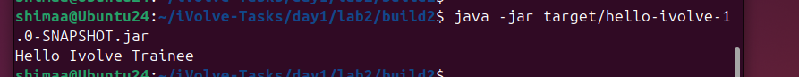
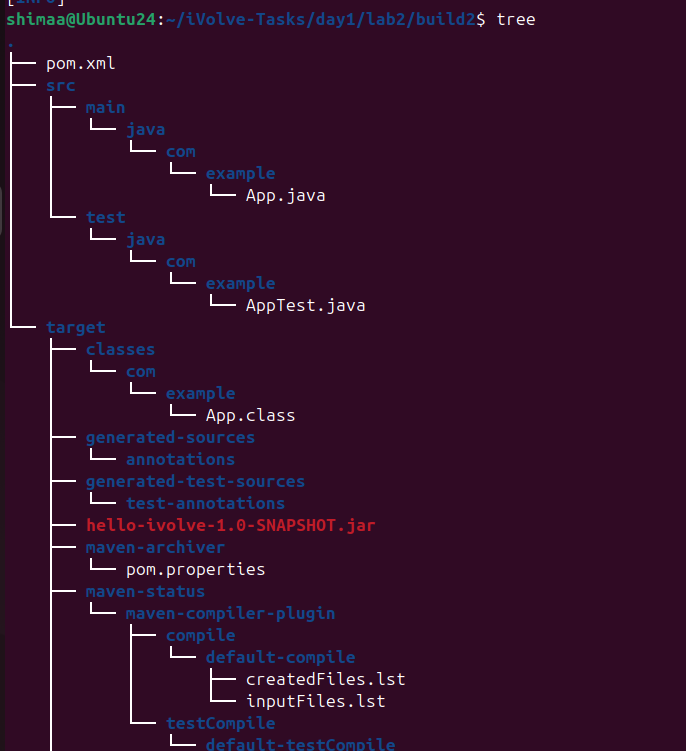

<p align="center">

</p>

## Build Tools with mvn

This lab demonstrates how to build, test, and package a Java application using **Maven**.  
The steps include installing Maven, cloning the source code, running unit tests, building the project, packaging the application, and running it.

---

## Step 1: Verify Installation

Check that maven are properly installed:

```bash
mvn -v
```

If maven is not installed, install it at first

---

## Step 2: Clone the Repository

Clone the source code from GitHub:

```bash
git clone https://github.com/Ibrahim-Adel15/build2
cd build2
```


---

## Step 3: Run Unit Tests

Execute the unit tests for the project:

```bash
mvn test
```




---

## Step 4: Build the Project

Package the project into a JAR file using maven:

```bash
mvn package
```

This will generate the artifact in `target/hello-ivolve-1.0-SNAPSHOT.jar`.


---

## Step 5: Run the Application

Run the packaged Java application using:

```bash
java -jar target/hello-ivolve-1.0-SNAPSHOT.jar
```



---

```bash
tree
```



---

## Summary

The complete Maven workflow for this project:
* Install and verify Maven installation
* Clone the repository from GitHub
* Run unit tests to verify functionality
* Build the JAR artifact with Maven
* Run the application using the Java runtime
