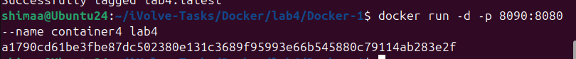

<p align="center">

</p>

## Run Java Spring Boot App in a Container

This lab demonstrates how to containerize and run a Java Spring Boot application using Docker with Java 17.

---

## Step 1: Clone the Application Code

Clone the source code from GitHub:

```bash
git clone https://github.com/Ibrahim-Adel15/Docker-1.git
cd Docker-1
```


---

## Step 3: Build the Application

```bash
mvn package
```


---

## Step 3: Write Dockerfile

Create a `Dockerfile` with the following content:

```dockerfile
FROM eclipse-temurin:17.0.17_10-jre-alpine-3.23
WORKDIR /lab4
COPY target/demo-0.0.1-SNAPSHOT.jar
CMD ["java", "-jar", "demo-0.0.1-SNAPSHOT.jar"]
EXPOSE 8080

```

---

## Step 4: Build Docker Image

Build the Docker image with the tag `lab4`:

```bash
docker build -t lab4 .
```

---

## Image Size Comparison (Lab 3 vs Lab 4)


Lab 4 image is smaller and more efficient, as it avoids Maven and source code inside the container.

---

## Step 4: Run Container

Run a container named `container4` from the `lab4` image:

```bash
docker run -d -p 8090:8080 --name container4 lab4
```



---

## Step 5: Test the Application

Test the application by accessing it in your browser or using curl:

```bash
curl http://localhost:8090
```

Or open your browser and navigate to: `http://localhost:8090`


---

## Step 6: Stop and Delete the Container

Stop and remove the container:

```bash
docker stop container4
docker rm container4
```


---

## Summary

The complete Docker workflow for this project:
* Clone the Spring Boot application from GitHub
* Successfully containerized Spring Boot app using Java 17
* Built optimized Docker image
* Ran and tested the application
* Managed container lifecycle
