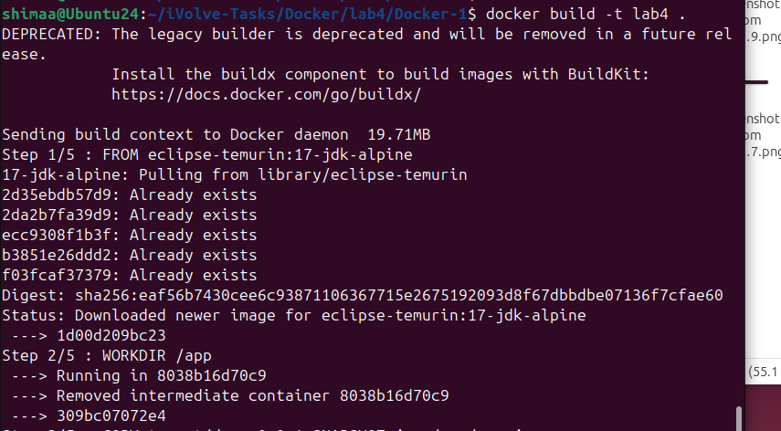
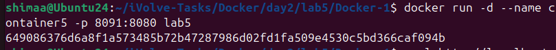
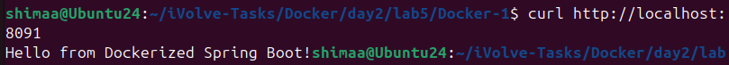
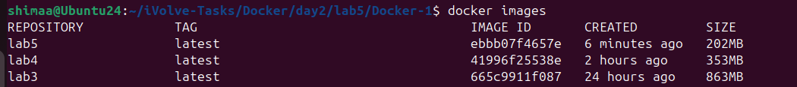

# Lab 5: Multi-Stage Build for a Java Spring Boot Application


This lab demonstrates how to build and run a Java Spring Boot application using Docker Multi-Stage Build.  
Multi-stage builds help reduce the final image size by separating the build stage from the runtime stage

---

## Step 1: Clone the Application Code

Clone the source code from GitHub:

```bash
git clone https://github.com/Ibrahim-Adel15/Docker-1.git
cd Docker-1
```

---

## Step 2: Write Multi-Stage Dockerfile

```dockerfile
# -------- Stage 1: Build --------
FROM maven:4.0.0-rc-5-eclipse-temurin-17-alpine AS build
WORKDIR /lab5
COPY . .
RUN mvn clean package -DskipTests

# -------- Stage 2: Runtime --------
FROM eclipse-temurin:17.0.17_10-jre-alpine-3.23
WORKDIR /final
COPY --from=build /lab5/target/demo-0.0.1-SNAPSHOT.jar demo-0.0.1-SNAPSHOT.jar
EXPOSE 8080
CMD ["java", "-jar", "demo-0.0.1-SNAPSHOT.jar"]

```

Stage 1 (Build): Uses Maven + Java 17 to build the application JAR.
Stage 2 (Runtime): Uses lightweight JRE image and copies only the JAR to create a smaller final image.

---

## Step 3: Build Docker Image

Create a `Dockerfile` with the following content:

```bash
docker build -t lab5 .

```


---

## Step 4: Run Container

Run a container named `container5` from the `lab5` image:

```bash
docker run -d -p 8091:8080 --name container5 lab5
```



---

## Step 5: Test the Application

Test the application by accessing it in your browser or using curl:

```bash
curl http://localhost:8091
```

Or open your browser and navigate to: `http://localhost:8091`



---

## Step 6: Stop and Delete the Container

Stop and remove the container:

```bash
docker stop container4
docker rm container4
```

---

## Step 7: Compare Image Sizes

Lab 3: Large image (Maven + source code included)
Lab 4: Smaller image (runtime only)
Lab 5: Smallest image (multi-stage build, runtime only)



---

## Summary

The complete Docker workflow for this project:
* Clone the Spring Boot application from GitHub
* Write a multi-stage Dockerfile
* Run and test the container
* Stop and delete the container
* Compare image sizes with previous labs
