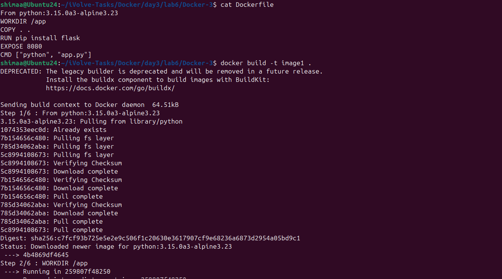
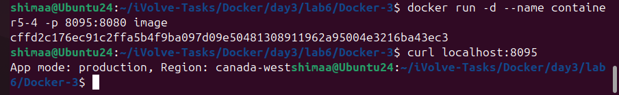
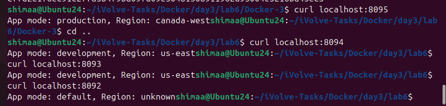

# Lab 6: Managing Docker Environment Variables Across Build and Runtime


This lab demonstrates how to manage environment variables in Docker at different stages:
- At runtime using the `docker run` command
- Using an external environment file
- At build time using the Dockerfile

---

## Step 1: Clone the Application Code

Clone the frontend and backend source code from GitHub:

```bash
git clone https://github.com/Ibrahim-Adel15/Docker-3.git
cd Docker-3
```

---

## Step 2: Write Dockerfile

```dockerfile
FROM python:3.11-slim
WORKDIR /app
COPY . .
RUN pip install flask
EXPOSE 8080
CMD ["python", "app.py"]
```

---

## Step 3: Build Docker Images

```bash
docker build -t image1 .
```



---

## Step 4: Run Container with Environment Variables in Command

```bash
docker run -d --name container5-3 -p 8094:8080 -e APP_MODE=development -e APP_REGION=us-east image1
```


---

## Step 5: Run Container Using Environment File

```bash
nano env
APP_MODE=staging
APP_REGION=us-west
```

```bash
docker run -d --name container5-2 -p 8093:8080 --env-file=env image1
```


---

## Step 6: Use Environment Variables from Dockerfile

```bash
cp Dockerfile Dockerfile2
nano Dockerfile2
FROM python:3.11-slim
WORKDIR /app
COPY . .
RUN pip install flask
ENV APP_MODE=production
ENV APP_REGION=canada-west
EXPOSE 8080
CMD ["python", "app.py"]
```

```bash
docker build -f Dockerfile2 -t image .
docker run -d --name container5-4 -p 8095:8080 image
```



---

## Test All 



---

## Summary

* Clone the Python Flask application
* Build Docker image
* Run container with environment variables via command line
* Run container using an environment file
* Use default environment variables defined in Dockerfile
* Test application using curl
