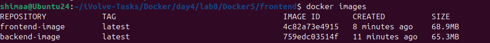
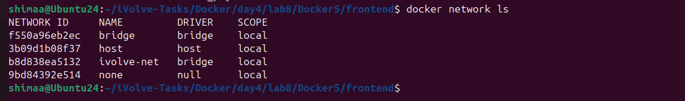
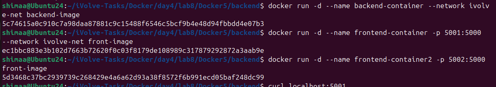

# Lab 8: Custom Docker Network for Microservices


This lab demonstrates how to create a custom Docker network and run multiple microservices (frontend and backend) using Python containers.  
It shows how containers can communicate across a user-defined network, while isolating services if needed.

---

## Step 1: Clone the Application Code

Clone the frontend and backend source code from GitHub:

```bash
git clone https://github.com/Ibrahim-Adel15/Docker-5.git
cd Docker-5
```

---

## Step 2: Create Dockerfiles

# Frontend Dockerfile

```dockerfile
FROM python:3.15.0a3-alpine3.23
WORKDIR /app
COPY . .
RUN pip install -r requirements.txt
EXPOSE 5000
CMD ["python", "app.py"]
```

# Backend Dockerfile

```dockerfile
FROM python:3.15.0a3-alpine3.23
WORKDIR /app
COPY . .
RUN pip install flask
EXPOSE 5000
CMD ["python", "app.py"]
```

---

## Step 3: Build Docker Images

```bash
docker build -t frontend-image ./frontend
docker build -t backend-image ./backend
```



---

## Step 4: Create a Custom Docker Network

```bash
docker network create ivolve-net
```



---

## Step 5: Run Containers on Networks

```bash
docker run -d --name backend-container --network ivolve-net backend-image
docker run -d --name frontend-container1 --network ivolve-net -p 5001:5000 frontend-image
docker run -d --name frontend-container2 -p 5002:5000 frontend-image
```



---

## Step 5: Verify Container Status

```bash
docker ps -a
```


---

## Summary

* Clone the Node.js + MySQL application from GitHub
* Write Dockerfiles for frontend and backend
* Build Docker images
* Create a custom Docker network
* Run backend and frontend containers on custom/default networks
* Test connectivity and access services

