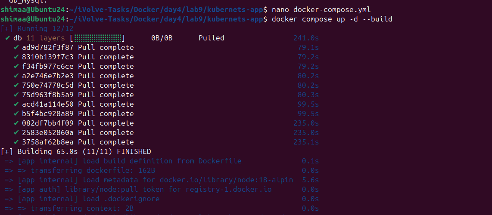
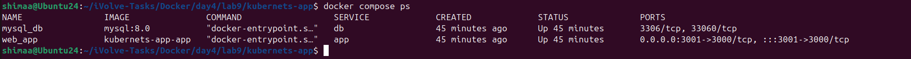
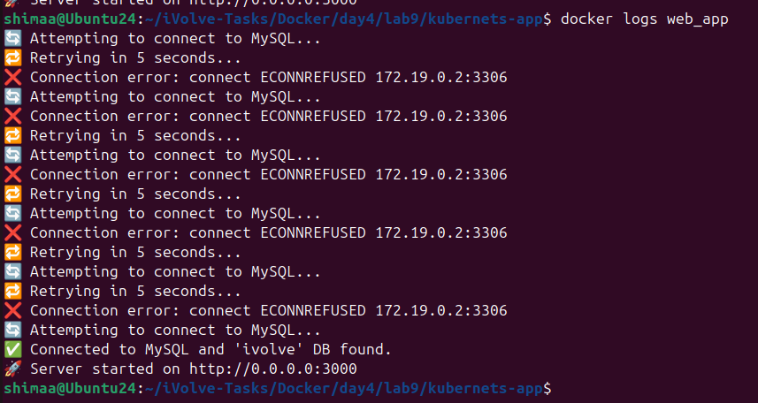
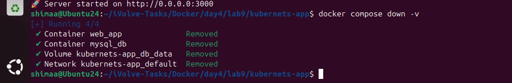

# Lab 9: Node.js Application with MySQL using Docker Compose


This lab demonstrates how to build and run a Node.js application with a MySQL database using Docker Compose.  
Docker Compose allows you to define and run multi-container applications easily, handling dependencies and environment configuration.

---

## Step 1: Clone the Application Code

Clone the source code from GitHub:

```bash
git clone https://github.com/Ibrahim-Adel15/kubernets-app.git
cd kubernets-app
```

---

## Step 2: Create docker-compose.yml

```yaml
version: "3.9"

services:
  web_app:
    build: .
    container_name: web_app
    ports:
      - "3001:3000"
    environment:
      DB_HOST: db
      DB_USER: appuser
      DB_PASSWORD: pass456
    depends_on:
      - db

  db:
    image: mysql:8.0
    container_name: mysql_db
    environment:
      MYSQL_ROOT_PASSWORD: pass123
      MYSQL_DATABASE: ivolve
      MYSQL_USER: appuser
      MYSQL_PASSWORD: pass456
    volumes:
      - db_mysql:/var/lib/mysql

volumes:
  db_mysql:

```

web_app: Node.js application container
db: MySQL container with persistent volume

---

## Step 3: Build and Start Containers

```bash
docker compose up -d --build
```



---

## Step 4: Verify Running Containers

```bash
docker compose ps
```



---

## Step 5: View Container Logs

```bash
docker compose logs -f web_app
```



---

## Step 5: Stop and Remove Containers

```bash
docker compose down -v
```



---

## Summary

* Clone the Node.js + MySQL application from GitHub
* Write docker-compose.yml to define multi-container setup
* Build and run containers using Docker Compose
* Verify running containers
* Test the application via browser or curl
* Stop and remove containers and volumes
