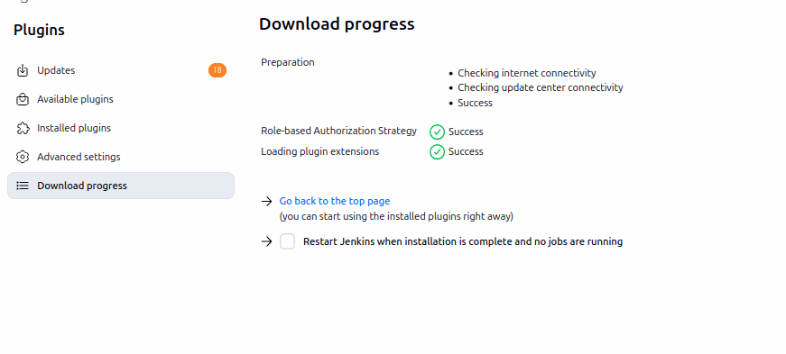
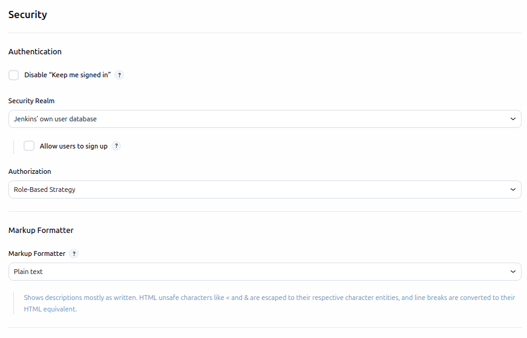
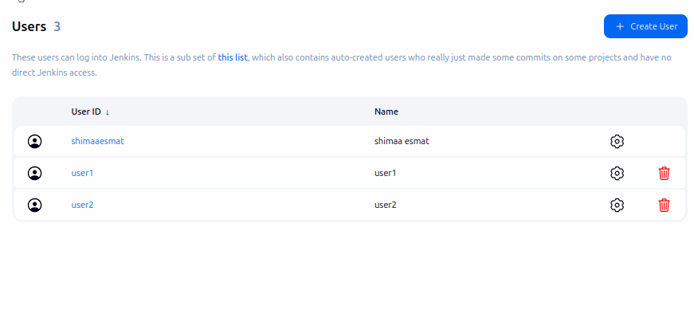
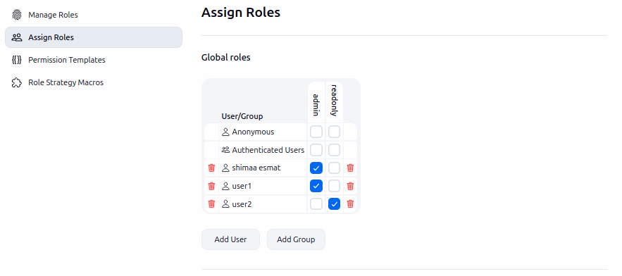

# Lab 21: Role Based Authorization in Jenkins

---

## Step 1:Install Role-Based Authorization Strategy Plugin

Go to Manage Jenkins → Manage Plugins.

Select the Role-Based Authorization Strategy and click Install

---

## Step 2:Enable Role-Based Authorization

Go to Manage Jenkins → Configure Global Security.
Under Authorization, select Role-Based Strategy.

---

## Step 3:Create Users

    Go to Manage Jenkins → Manage Users.
    Click Create User.

---

## Step 4:Create Roles

    Go to Manage Jenkins → Manage and Assign Roles → Manage Roles.

---

## Step 5:Assign Roles to Users

    Go to Manage Jenkins → Manage and Assign Roles → Assign Roles

