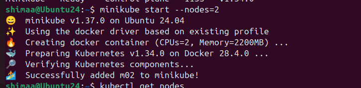
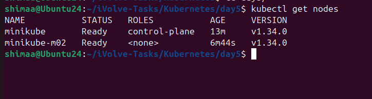
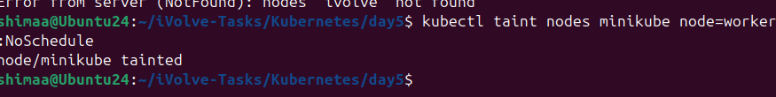
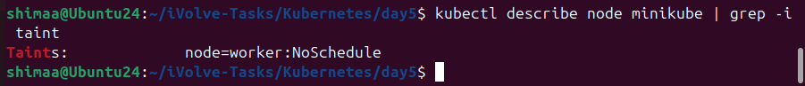
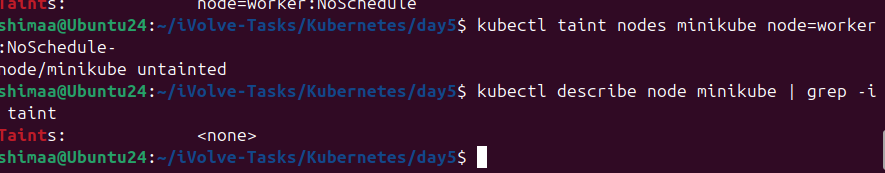

---

# Lab 10: Node Isolation Using Taints in Kubernetes

- Run Kubernetes cluster with 2 nodes
- Taint one node with key-value `node=worker` and effect `NoSchedule`
- Describe nodes to verify taint

---

## Step 1: Start Minikube with 2 nodes

```bash
minikube start --nodes=2
```



# Verify Nodes

```bash
kubectl get nodes
```



---

## Step 2: Apply taint to worker node

```bash
kubectl taint nodes minikube node=worker:NoSchedule
```



---

## Step 3: Remove taint from control-plane

```bash
kubectl taint nodes minikube node=worker:NoSchedule-
```



---

## Summary

* Worker node is isolated
* Pods without tolerance cannot be scheduled on worker node
