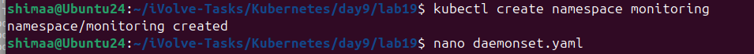
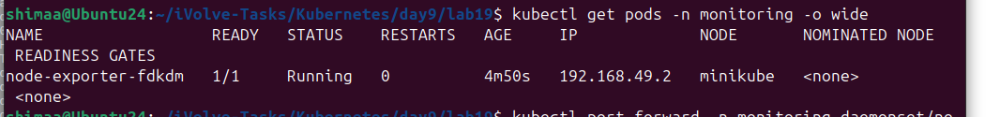
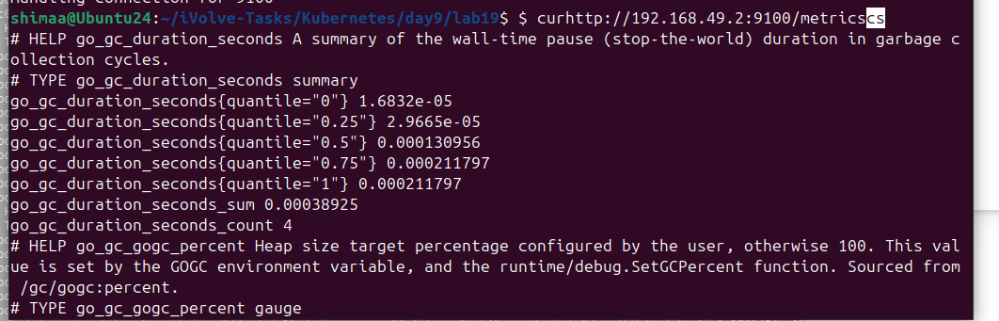

# Lab 19:Node-Wide Pod Management with DaemonSet


---

In this lab, we deploy Prometheus Node Exporter as a DaemonSet to ensure one pod runs on every node, even nodes with taints.

---

## Step 1:Create the monitoring Namespace

```bash
kubectl create namespace monitoring
```



---

## Step 2:Create the DaemonSet

```yaml
apiVersion: apps/v1
kind: DaemonSet
metadata:
  name: node-exporter
  namespace: monitoring
  labels:
    app: node-exporter
spec:
  selector:
    matchLabels:
      app: node-exporter
  template:
    metadata:
      labels:
        app: node-exporter
    spec:
      tolerations:
      - key: "node"
        operator: "Equal"
        value: "worker"
        effect: "NoSchedule"
      - key: "node-role.kubernetes.io/control-plane"
        operator: "Exists"
        effect: "NoSchedule"
      - key: "node-role.kubernetes.io/master"
        operator: "Exists"
        effect: "NoSchedule"
      - operator: "Exists"
      hostNetwork: true
      hostPID: true
      containers:
      - name: node-exporter
        image: prom/node-exporter:latest
        args:
        - --path.procfs=/host/proc
        - --path.sysfs=/host/sys
        - --path.rootfs=/host/root
        ports:
        - containerPort: 9100
          hostPort: 9100
          name: metrics
        volumeMounts:
        - name: proc
          mountPath: /host/proc
          readOnly: true
        - name: sys
          mountPath: /host/sys
          readOnly: true
        - name: root
          mountPath: /host/root
          mountPropagation: HostToContainer
          readOnly: true
        resources:
          requests:
            cpu: 100m
            memory: 128Mi
          limits:
            cpu: 200m
            memory: 256Mi
        securityContext:
          allowPrivilegeEscalation: false
          readOnlyRootFilesystem: true
      volumes:
      - name: proc
        hostPath:
          path: /proc
      - name: sys
        hostPath:
          path: /sys
      - name: root
        hostPath:
          path: /
```

```bash
kubectl apply -f node-exporter-daemonset.yaml
```


---

## Step 3:Validate Pod Scheduling

```bash
kubectl get pods -n monitoring -o wide
```



---

## Step 4:Confirm Metrics Exposure

```bash
curl http://192.168.49.2:9100/metrics
```



---
