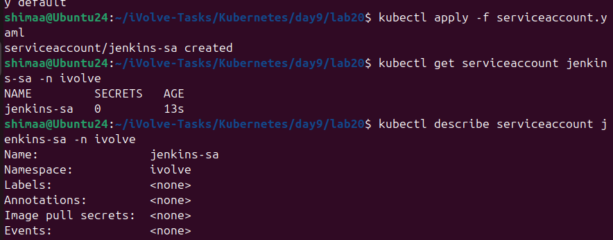
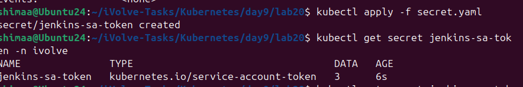
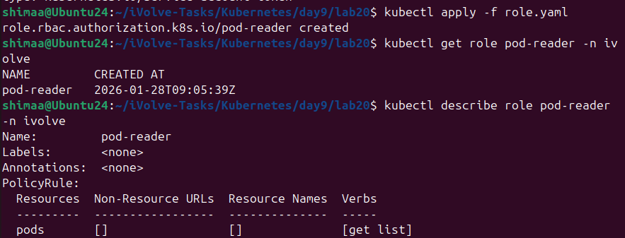
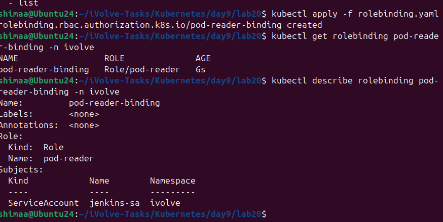
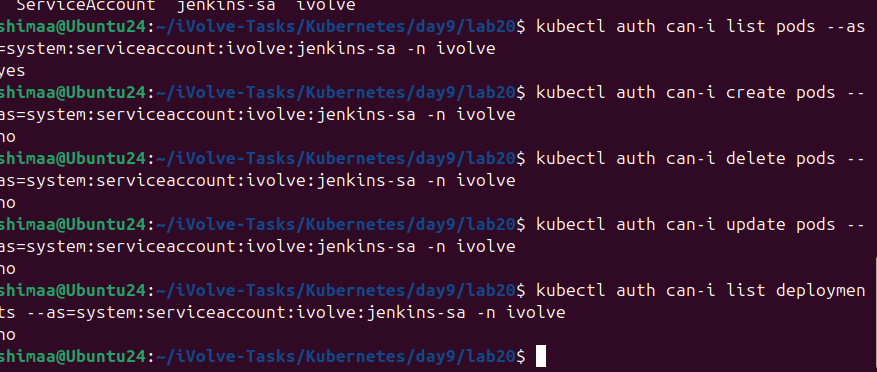

# Lab 20: Securing Kubernetes with RBAC and Service Accounts


---

This lab demonstrates how to secure access to Kubernetes resources using RBAC (Role-Based Access Control) and ServiceAccounts.

---

## Step 1:Create the ServiceAccount

```bash
kubectl apply -f serviceaccount.yaml
```

```yaml
apiVersion: v1
kind: ServiceAccount
metadata:
  name: jenkins-sa
  namespace: ivolve
```



---

## Step 2:Create Secret and Retrieve Token

```yaml
apiVersion: v1
kind: Secret
metadata:
  name: jenkins-sa-token
  namespace: ivolve
  annotations:
    kubernetes.io/service-account.name: jenkins-sa
type: kubernetes.io/service-account-token
```

```bash
kubectl apply -f jenkins-sa-secret.yaml
```



---

## Step 3:Create Role with Read-Only Permissions

```bash
kubectl get pods -n monitoring -o wide
```

```yaml
apiVersion: rbac.authorization.k8s.io/v1
kind: Role
metadata:
  name: pod-reader
  namespace: ivolve
rules:
- apiGroups: [""]  # "" indicates core API group
  resources: ["pods"]
  verbs: ["get", "list"]
```



---

## Step 4:Create RoleBinding

```bash
kubectl apply -f rolebinding.yaml
```

```yaml
apiVersion: rbac.authorization.k8s.io/v1
kind: RoleBinding
metadata:
  name: pod-reader-binding
  namespace: ivolve
subjects:
- kind: ServiceAccount
  name: jenkins-sa
  namespace: ivolve
roleRef:
  kind: Role
  name: pod-reader
  apiGroup: rbac.authorization.k8s.io
```



---

## Step 5:Validate Permissions

```bash
kubectl auth can-i get pods --as=system:serviceaccount:ivolve:jenkins-sa -n ivolve

-- yes
```

```bash
kubectl auth can-i create pods --as=system:serviceaccount:ivolve:jenkins-sa -n ivolve

-- no
```

```bash
kubectl auth can-i delete pods --as=system:serviceaccount:ivolve:jenkins-sa -n ivolve

--no
```

```bash
kubectl auth can-i update pods --as=system:serviceaccount:ivolve:jenkins-sa -n ivolve

--no
```

```bash
kubectl auth can-i list deployments --as=system:serviceaccount:ivolve:jenkins-sa -n ivolve

--no
```


